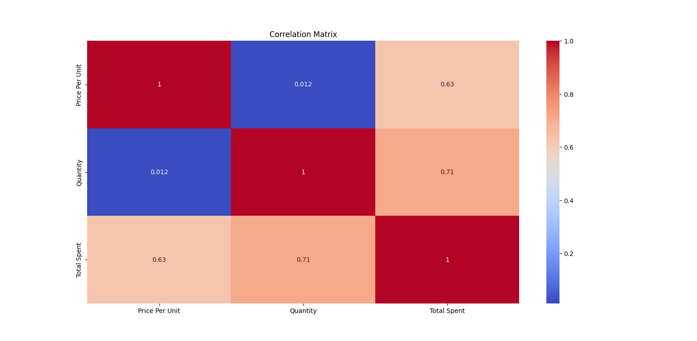
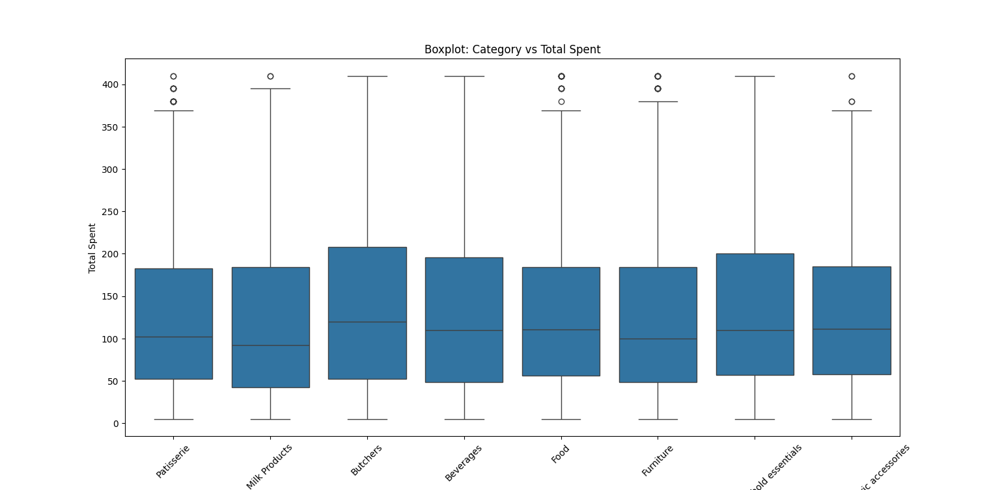
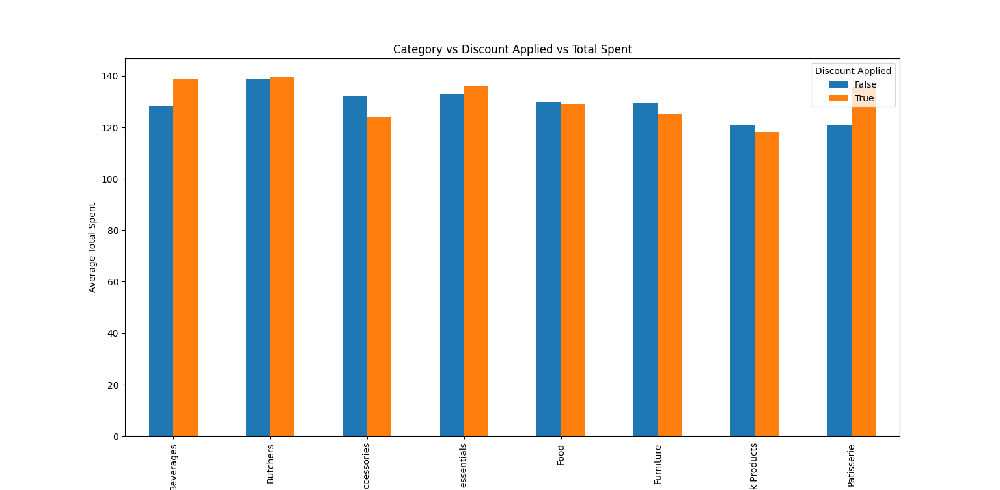
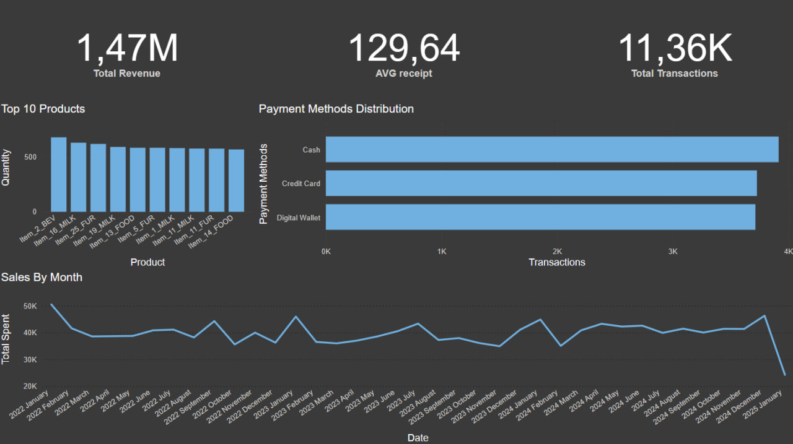

# Retail Store Sales Analysis

## 📌 Project Overview
This project analyzes retail store sales data using **Python, SQL, and Power BI**. The goal is to gain insights into sales trends.

## 🔍 Key Objectives
1. **Data Cleaning & Preprocessing** (Python & SQL)
   - Handle missing values
   - Standardize data types
   - Detect and remove anomalies

2. **Exploratory Data Analysis (EDA)** (Python: Pandas, Seaborn, Matplotlib)
   - Sales trends by time (monthly, weekly analysis)
   - Top-selling products and categories

3. **Data Visualization** (Power BI)
   - 📊 Sales trends by month
   - 🛍️ Best-selling products
   - 🏪 Average purchase amount
   - 💳 Most popular payment methods

### 1. Heatmap of Numerical Variables

### 2. Category VS Total Spent

### 3. Category VS Discount VS Total Spent

## 🛠️ Tools & Technologies
- **Python** (Pandas, NumPy, Matplotlib, Seaborn)
- **SQL** (PostgreSQL for data transformation and querying)
- **Power BI** (for interactive dashboards)

## 📂 Dataset
- **File:** `retail_store_sales.csv`
- **Columns:**
  - `Transaction ID`, `Customer ID`, `Category`, `Item`, `Price Per Unit`, `Quantity`, `Total Spent`, `Payment Method`, `Location`, `Transaction Date`, `Discount Applied`
- **Size:** ~10,000+ transactions

## 🔧 Data Processing Steps
1. **Load Data**: Import dataset into **Pandas** and **PostgreSQL**.
2. **Handle Missing Values**:
   - Fill missing `Item` values based on `Category` & `Price Per Unit`.
   - Estimate missing `Price Per Unit` based on similar products.
   - Fill `Discount Applied` appropriately (e.g., 0 if missing).
3. **Store Data in PostgreSQL** for further analysis.

## 📊 Power BI Dashboard
The final dashboard includes:
- **Monthly Sales Trend**
- **Top Products**
- **Payment Method Preferences**

## 📬 Contact
For any questions, feel free to reach out!
- **GitHub**: [github.com/tenmongit](https://github.com/tenmongit)
- **Email**: [tenmonwork@outlook.com](mailto:tenmonwork@outlook.com)
